# A Finder for Amiga Files

Just like you manage files in macOS Finder, it would be so useful to do the same with ADF disks, well... now you can.

## Open ADFs
You can open an ADF with just drag and drop or using the classical options (menu/botton)
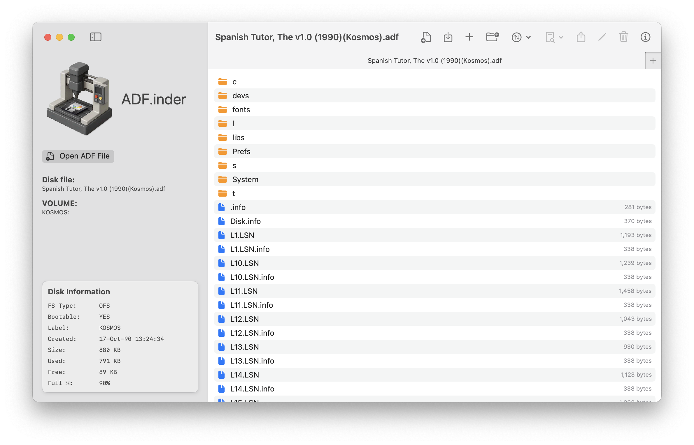

## New Images
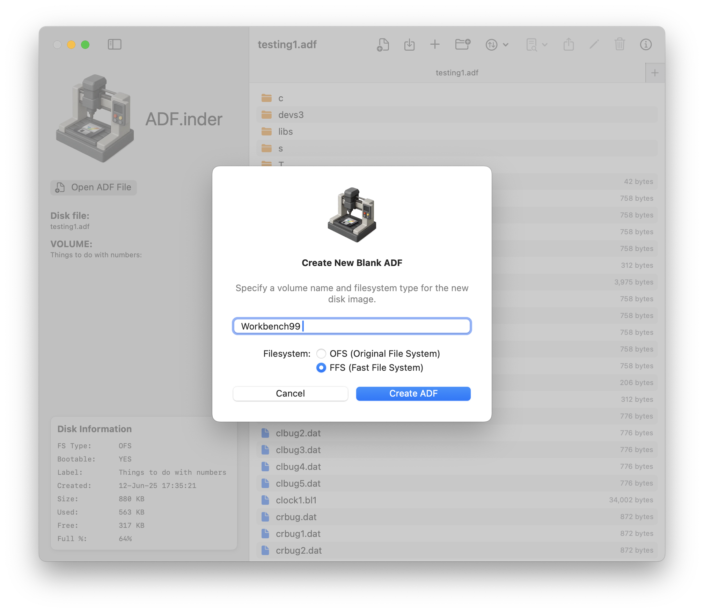

## Multi Disks Opening
You can open multiple disk at the same time via tabs or multiple windows.
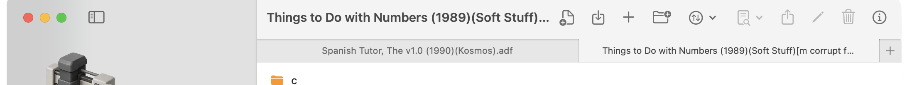

## Sorting
You can sort by filename and file size.
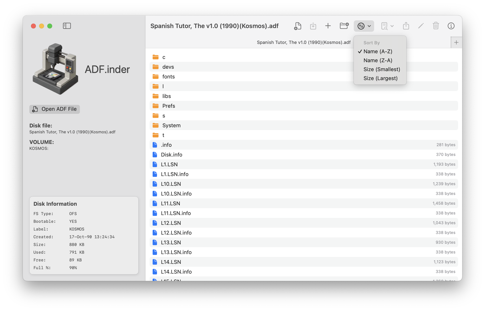

## File Management
You can delete, rename and export files. It will honor the Amiga file bits settings so if a file is marked as non deletable it will prevent a deletion. However, you can override such default AmigaOS behavior.
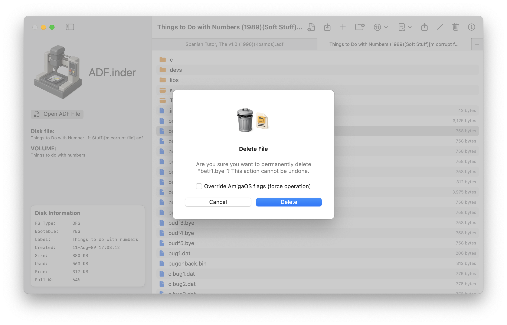

## Plugins
As more plugins are added you can perform addition process over a selected item. The first one is a HEX EDITOR.
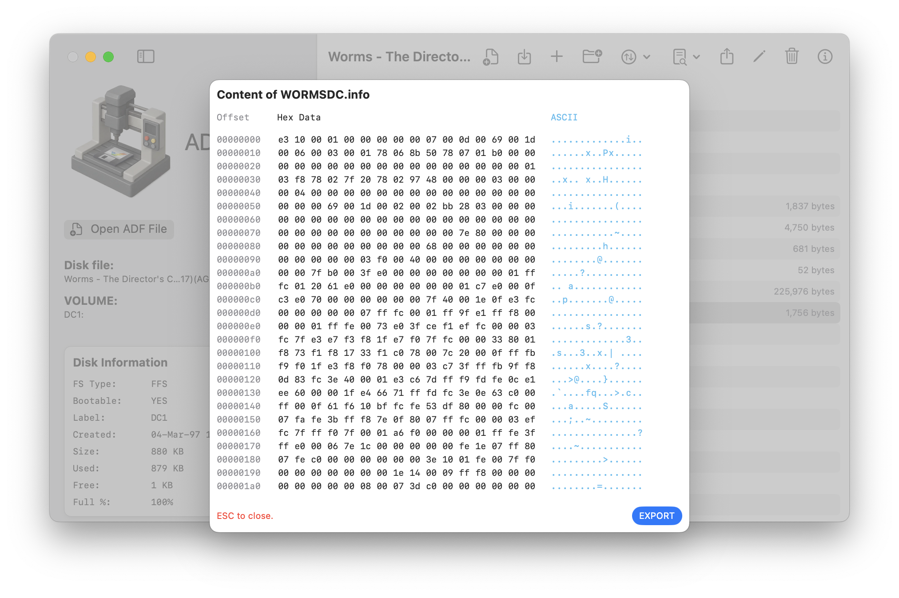
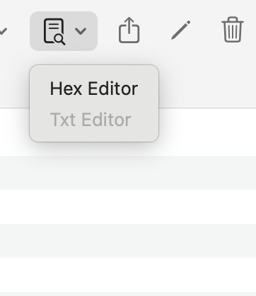
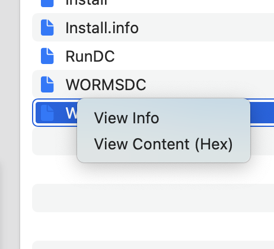
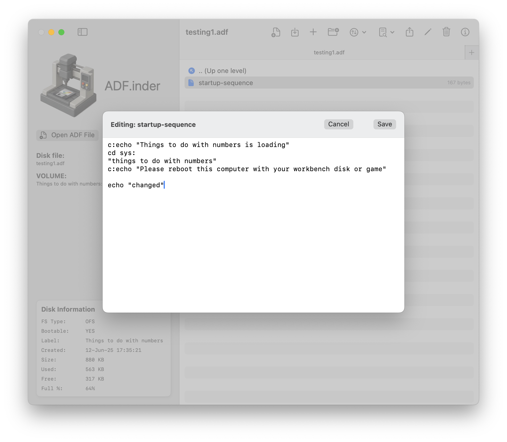

## Other Features
You can perform most tasks via the toolbar but some options are located in the Amiga menu. Like changing volume name.
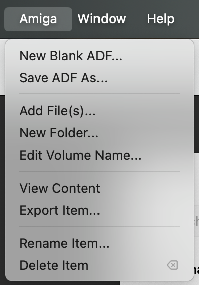
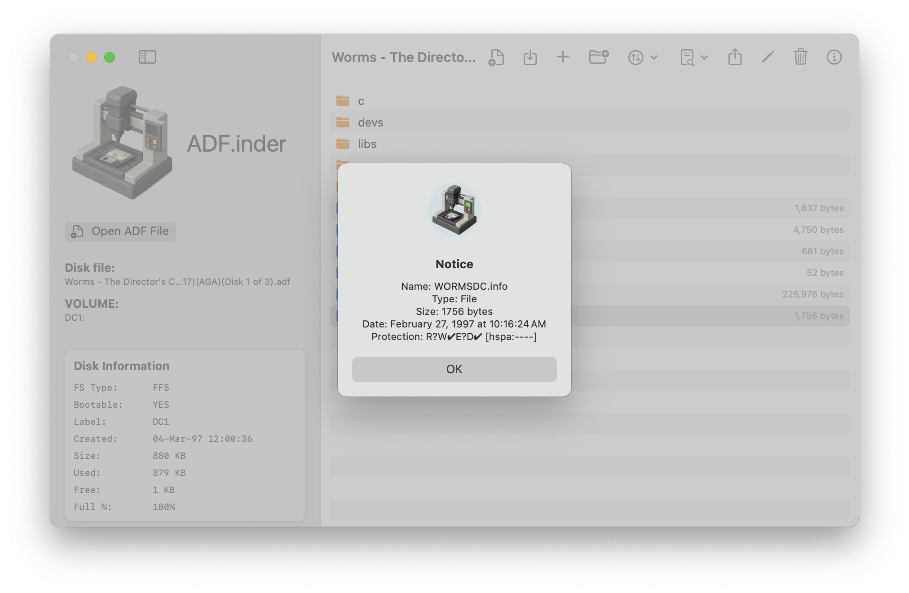

# More to come
I work on this project when I carve time, however, I hace seen such a solid interest behind it that has been motivating me to find more time to keep the project growing. So, thank you!