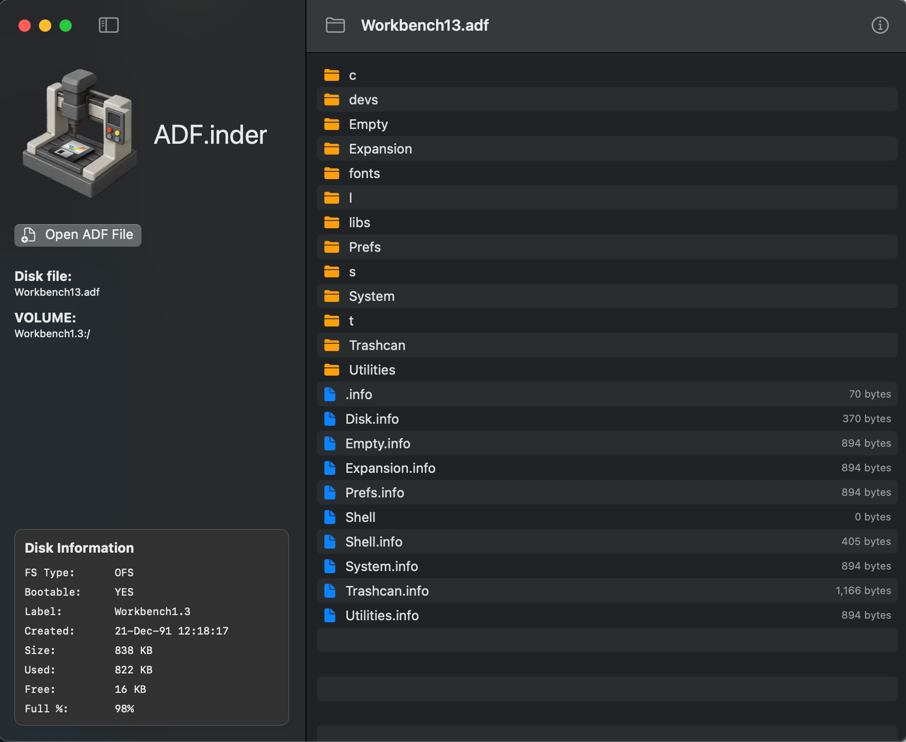
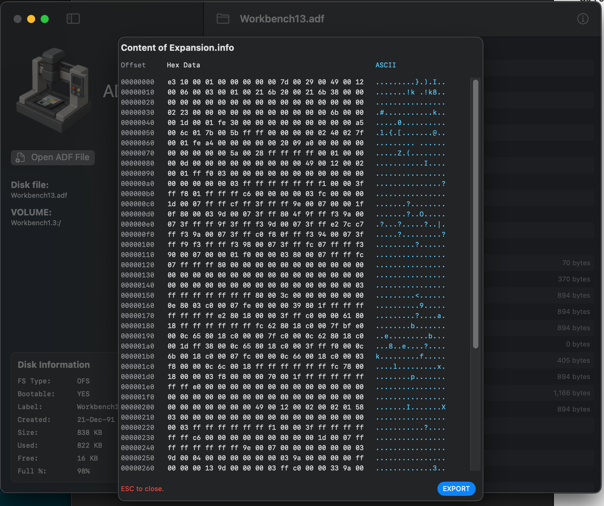

# ADFinder

I found myself wanting to work on an ADF image in the same way modern computers allow to manage files. 

macOS spoils users with the easy going user interface and I didn't find any tool out there that would offer the rich experience and being compatible with the need of an amiga engineer.

So I start building it. Details and pre-built app are [here](https://ginnov.github.io/littlethings/)

## Features List

1. ✅ Load ADFs that workbench can read
2. ✅ Show the content of files in a HEX editor
3. ✅ Navigate folder structure back and forth
4. ✅ Delete files and folder
7. ✅ Create an ADF from scratch
11. ✅ Open ADF images by dropping the image over the files' window
12. ✅ Show disk layout, file usage and other stats
13. ✅ Create new folders
14. ✅ Rename files and folders
15. ✅ Sorting (different kinds)
16. ✅ Preferences

## Work in Progress
5. 👷🏻 Add files
6. 👷🏻 Add support for Drag and Drop for new files 
8. 👷🏻 Compare two ADF images (raw or files matching?)
9. 👷🏻 Auto convert audio when adding them to an image
10. 👷🏻 Auto convert image format wehn adding them to an image
17. 👷🏻 Text view (to copy files)
18.  👷🏻Download files

## Users requests
* Change volume's name [[warpdesign](https://github.com/warpdesign)]

# What it looks like?
If you are just curios about the app, here are some screenshots.
The main UI allows you to navigate folders and do some file operations on it.

### Hex Viewer
There are several tools built in, one of the them is a HEX editor.

